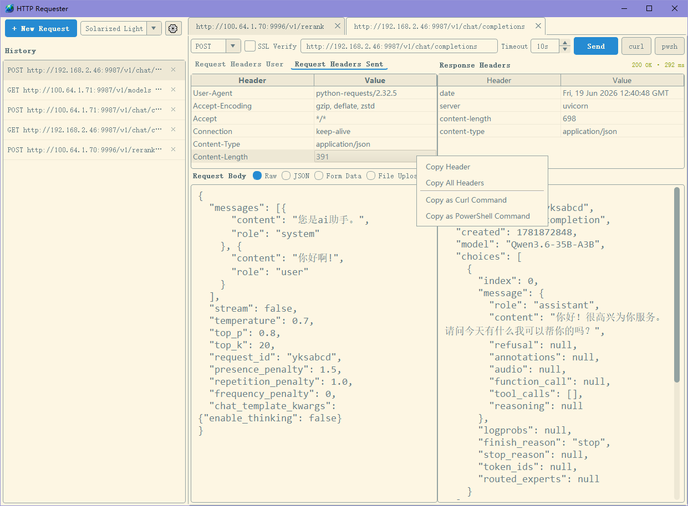

# HTTP Requester

A lightweight desktop HTTP client built with **Python** and **PyQt5**.

## Why this project?

I wanted a simple tool to send and inspect HTTP requests without installing the Electron-based Postman client. After installation, Postman easily takes up **~500 MB** on disk — far more than I need for everyday API testing. HTTP Requester keeps the workflow familiar while staying small, fast to launch, and easy to hack on.

## Screenshot



## Features

- **HTTP methods** — GET, POST, PUT, DELETE, PATCH, HEAD, OPTIONS
- **Request headers** — editable key/value table with per-row enable/disable
- **Request body** — Raw, JSON, Form Data, and File Upload
- **Options** — configurable timeout and SSL certificate verification
- **Response view** — status line, response headers, and body (JSON is pretty-printed when possible)
- **Non-blocking UI** — requests run in background threads
- **History** — save, rename, reopen, and delete past requests
- **Multi-tab workspace** — open several requests at once; tabs are closable and draggable
- **Session restore** — window layout, splitter sizes, and open tabs are persisted across restarts
- **Clean UI** — Fusion style with a Solarized-inspired theme

## Requirements

- Python 3.8+
- PyQt5
- requests

## Installation

```bash
pip install -r requirements.txt
```

## Portable release (Windows)

Each release includes a portable **~18 MB** 7z archive for **Windows 7** and later. The package bundles a self-contained **Python 3.11** runtime and all required libraries, so you can extract it and run `HttpRequester.exe` without installing Python or running `pip` on your system.

## Usage

```bash
python main.py
```

1. Click **+ New Request** to open a tab.
2. Enter the URL, method, headers, and body as needed.
3. Click **Send** to execute the request.
4. Saved requests appear in the history panel on the left — click to reopen, or delete when no longer needed.

## Data files

The app stores local data in the project directory:

| File | Purpose |
|------|---------|
| `history.json` | Saved request/response history |
| `session.json` | Window size, splitter layout, and open tabs |

These files are listed in `.gitignore` and are not committed to version control.

## Project layout

```
http-requester/
├── main.py                 # Application entry point
├── models/                 # Data models (requests, history records)
├── services/               # HTTP request execution (requests library)
├── storage/                # History and session persistence
├── ui/                     # PyQt5 widgets and theme
├── pyqt_async_task.py      # Background task helper
└── requirements.txt
```

## License

MIT.
